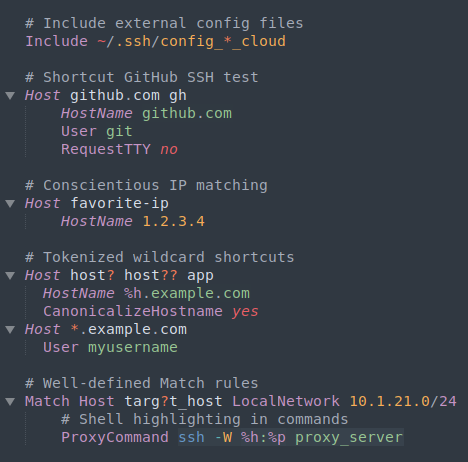

# SSH Config Language

Provides highlighting and snippets
in [Sublime Text][st]
for [*~/.ssh/config*][ssh-config],
[*/etc/ssh/sshd_config*][sshd-config],
and some other SSH-related files.




## Installation

This package [is available][pkg]
via [Package Control][pkg-ctrl].
You can install it
by searching for SSH
in the **Package Control: Install Package** interface
or by cloning this repository
into your Sublime Text *Packages* directory.


## Features

### Commands

- Edit package settings
- Quick open files:
    + SSH Config
    + SSHD Config
    + Authorized Keys
    + Known Hosts

If the file-open commands open the wrong file for you,
open the Command Palette
(<kbd>Ctrl</kbd>+<kbd>Shift</kbd>+<kbd>P</kbd> or
 <kbd>Cmd</kbd>+<kbd>Shift</kbd>+<kbd>P</kbd>),
search for **SSH Config: Settings**,
and put in content like this:

```jsonc
{
    "file_locations": {
        "ssh_config": "~/.ssh/config",
        "sshd_config": "/etc/ssh/sshd_config",
        "known_hosts": "~/.ssh/known_hosts",
        "authorized_keys": "~/.ssh/authorized_keys",
    },
}
```


### SSH Config files

- Syntax highlighting
- `host` snippet creates a new **Host** entry
- `match` snippet creates a new **Match** entry
- Keyword completion for many parameters
  on Linux and BSD
- Symbol Index for hosts and aliases
  (<kbd>Ctrl</kbd>+<kbd>R</kbd> or
   <kbd>Cmd</kbd>+<kbd>R</kbd>)
- Automatic indentation

Note that *~/.ssh/config* is not linked
to the SSH Config syntax highlighting
out of the box.
This is because the filename is shared
by other formats
(notably *.git/config*)
and we don't want to set the wrong highlighting for those.
Several solutions are [available on the wiki][wiki-activation].

For file format information,
consult `man` pages on the web
for [Linux][man-linux-ssh-config]
or [BSD][man-bsd-ssh-config],
or locally on your machine with

```sh
man 5 ssh_config
```


### SSHD Config files

- Syntax highlighting
- Keyword completion for many parameters
  on Linux and BSD
- Symbol Index for active and commented-out config options
  (<kbd>Ctrl</kbd>+<kbd>R</kbd> or
   <kbd>Cmd</kbd>+<kbd>R</kbd>)
- Automatic indentation

For file format information,
consult `man` pages on the web
for [Linux][man-linux-sshd-config]
or [BSD][man-bsd-sshd-config],
or locally on your machine with

```sh
man 5 sshd_config
```


### Authorized Keys files

- Syntax highlighting
- Keyword completion for access restrictions
- Symbol Index for annotations,
  which are typically the `user@host`,
  (<kbd>Ctrl</kbd>+<kbd>R</kbd> or
   <kbd>Cmd</kbd>+<kbd>R</kbd>)

Public keys are also associated with this syntax,
since the *authorized_keys* format
is basically a strict superset of them.

For file format information,
consult `man` pages on the web
for [Linux][man-linux-authorized-keys]
or [BSD][man-bsd-authorized-keys],
or locally on your machine with

```sh
PAGER='less -p ^"AUTHORIZED_KEYS"' man 8 sshd
```


### Known Hosts files

- Syntax highlighting
- Symbol Index for hosts and IPs
  (<kbd>Ctrl</kbd>+<kbd>R</kbd> or
   <kbd>Cmd</kbd>+<kbd>R</kbd>)

For file format information,
consult `man` pages on the web
for [Linux][man-linux-known-hosts]
or [BSD][man-bsd-known-hosts],
or locally on your machine with

```sh
PAGER='less -p ^"SSH_KNOWN_HOSTS"' man 8 sshd
```


### Extras

- PEM, PKCS1, PKCS8, and SSH keys have
    + Syntax highlighting
    + Symbol index for cert bundles
- Completion and highlighting for crypto stuff
    + Key types (`ssh -Q key`)
    + KEX algorithms (`ssh -Q kex`)
    + Encryption ciphers (`ssh -Q ciphers`)
    + MACs (`ssh -Q mac`)


## Building

- Snippets, completions, and crypto names
  are built from the *src* directory
  in a simple Python script.
  Its only requirement is `pyyaml`.
- Changes to any of the above
  should be modified in YAML and rebuilt.
- Changes to syntaxes do not need rebuilding,
  but do need regression testing.


## Syntax testing

- Install this repository under Sublime Text *Packages*
  and name it *SSH Config*.
    + You can clone it there directly, move it there, or symlink it.
- Open the project from under *Packages/SSH Config*.
- Open a syntax test file located in the *test* directory.
- Run the **Build With: Syntax Tests** command.
    + This is supplied by the **Default** Package,
      which is shipped with Sublime Text.
    + The command is available on the Command Palette
      when any test file is open.

The [PackageDev][] package is helpful for writing tests but not required.


[st]: https://www.sublimetext.com
[ssh-config]: #ssh-config-files
[sshd-config]: #sshd-config-files
[man-linux-ssh-config]: https://man7.org/linux/man-pages/man5/ssh_config.5.html "Linux Man page for SSH Config"
[man-linux-sshd-config]: https://man7.org/linux/man-pages/man5/sshd_config.5.html "Linux Man page for SSHD Config"
[man-linux-authorized-keys]: https://www.man7.org/linux/man-pages/man8/sshd.8.html#AUTHORIZED_KEYS_FILE_FORMAT "Linux Man page for Authorized Keys"
[man-linux-known-hosts]: https://www.man7.org/linux/man-pages/man8/sshd.8.html#SSH_KNOWN_HOSTS_FILE_FORMAT "Linux Man page for Known Hosts"
[man-bsd-ssh-config]: https://man.openbsd.org/ssh_config.5 "BSD Man page for SSH Config"
[man-bsd-sshd-config]: https://man.openbsd.org/sshd_config.5 "BSD Man page for SSHD Config"
[man-bsd-authorized-keys]: https://man.openbsd.org/sshd.8#AUTHORIZED_KEYS_FILE_FORMAT "BSD Man page for Authorized Keys"
[man-bsd-known-hosts]: https://man.openbsd.org/sshd.8#SSH_KNOWN_HOSTS_FILE_FORMAT "BSD Man page for Known Hosts"
[pkg]: https://packagecontrol.io/packages/SSH%20Config
[pkg-ctrl]: https://packagecontrol.io
[wiki-activation]: https://github.com/robballou/sublimetext-sshconfig/wiki/Activate-SSH-Config-highlighting
[packagedev]: https://packagecontrol.io/packages/PackageDev
